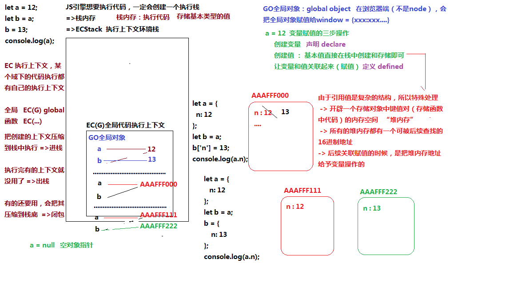

# 模块一：全面攻克JavaScript底层三座大山

## 1.堆栈内存及闭包作用于

### 1.1 JS 的8中数据类型及区别

- 基本数据类型（值类型）
  -  number string boolean null undefined

- 引用数据类型
  - object：{} [] /^$/ 日期对象 Math 实例对象... 
  - function

- ES6中新增
  -  Symbol 唯一值


`typeof` 检测数据类型

```javascript
console.log(typeof NaN); //=>"number"  不是一个有效数字，但是属于number数字类型

// NaN==NaN也是不相等，它和谁都不相等，所以检测是否为有效数字需要用isNaN
isNaN(0)    //false
isNaN('a')  //true
isNaN('10') // false
// 先执行的 number()
```

object

> 1. 对象的属性名可以使基本引用值
>
> 2. 对象的属性名一定不能是引用类型值,默认会把引用类型值转换为字符串进行处理

```javascript
// 默认会把引用类型值转换为字符串进行处理例子：
let a = {
  x: 100
};
let b = function fn() {
  let a = 100;
}
let obj = {
  0: 100,
  true: '珠峰'
};
obj[a] = 1000;
obj[b] = 2000;

// 1. 对象的属性名可以使基本引用值
obj[0] // 100
obj['0'] // 100
obj[true] // 100
obj['true'] // 100

// 2.默认会把引用类型值转换为字符串进行处理
0: 100
[object Object]: 1000
"function fn() {↵ let a = 100;↵ }": 2000
true: "珠峰"
__proto__: Object


// 阿里面试题
let a = {
  x: 100
};
let b = {
  y: 200
};
let obj = {};
obj[a] = '珠峰';
//=>obj["[object Object]"]="珠峰";
obj[b] = "培训";
//=>obj["[object Object]"]="培训";
console.log(obj[a] === obj[b]);  //=>TRUE
```

数组是特殊的对象

```javascript
console.log([12, 23, 34]);
// ↓ 输出
(3) [12, 23, 34]
0: 12
1: 23
2: 34
length: 3
```

### 1.2  JS 堆栈内存的运行机制

编译器（把代码解析成浏览器看得懂的结构）

- 词法解析 ↓

- AST 抽象语法树 ↓

- 构建出浏览器能执行的代码 ↓

引擎（ V8 / webkit内核 ）

- 变量提升 
- 作用域 / 闭包 
- 变量对象
- 堆栈内存
- GO / VO / AO / EC / ECStack

举例：




a = 12 变量赋值的三步操作：

- 1.创建变量： 声明 declare

- 2.创建值：基本值直接在栈中创建和存储即可（**复杂引用值结构使用堆**）

- 3.让变量和值关联起来（赋值） 定义 defined

课后题：

```javascript
/*阿里面试题*/
let a = {
    n: 10
};
let b = a;
b.m = b = {
    n: 20
};
console.log(a);
console.log(b);

// ↓ 输出
{ n: 10 ,m: { n: 20 } } 
{ n: 20 }
// 关键 b.m 先执行  执行时b当时指向 { n: 10 }  =》 { n: 10 ,m: undefined } 
// 然后执行 b = { n: 20 } 修改b的执行
// 再执行 b.m = b  也就是把 { n: 10 ,m: undefined } 中 m 指向了 { n: 20 }
```

```javascript
/*360面试题*/
let x = [12, 23];
function fn(y) {
    y[0] = 100;
    y = [100];
    y[1] = 200;
    console.log(y);
}
fn(x);
console.log(x);

// ↓ 输出
[100, 200]
[100, 23] // y=[100] 切换了指向 所以23没有变化
```


### 1.3  变量提升机制


### 1.4  作用于和作用域链